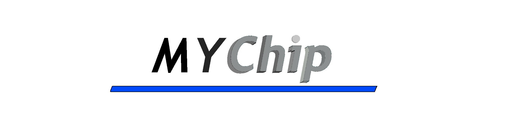

(realy bad first logo)

My Chip is a project thing that I upload like Verilog code and basic compiled gds files made by openlane.
## Requests.
Any Questions Requests Or anything else make a issue or pull request and i will compile your verilog myself because openlane is realy big and i dont think anyone else wants like 17gb of space just for a chip.
All Verilog and chip files will be public and for the hole collection of users to use and test in whatever anyone needs this many chip designs for.

Todo:
make better banner it took 4 hrs for the current banner 😭 and somehow in the middle I accidentally made the text look like 90s 3d so I'm keeping it like that.
fix the banner location to the right

